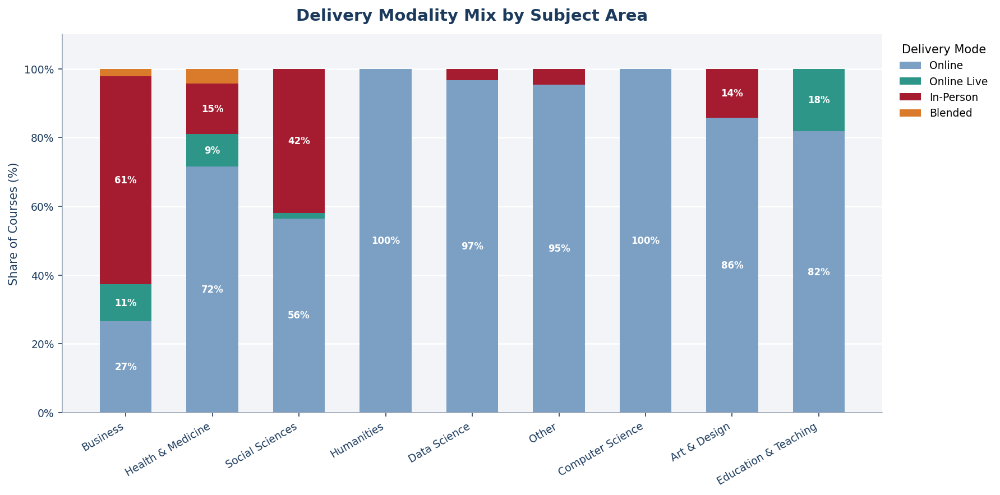
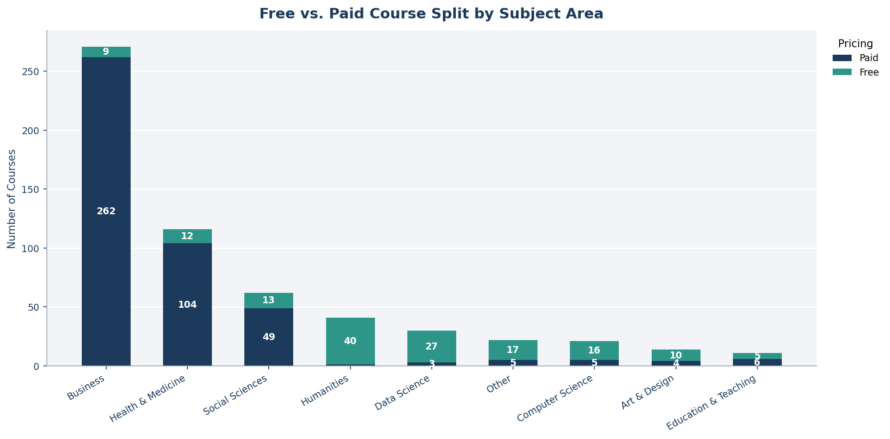
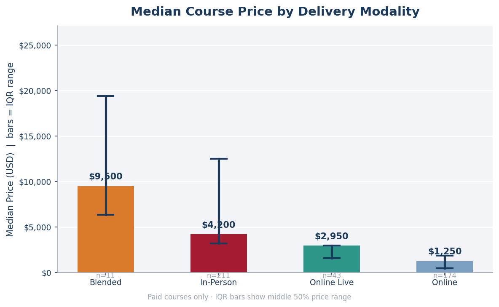
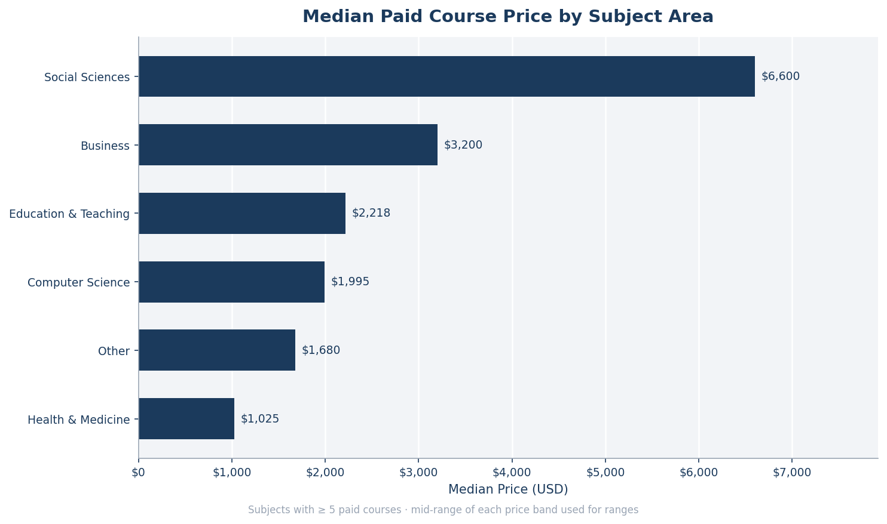
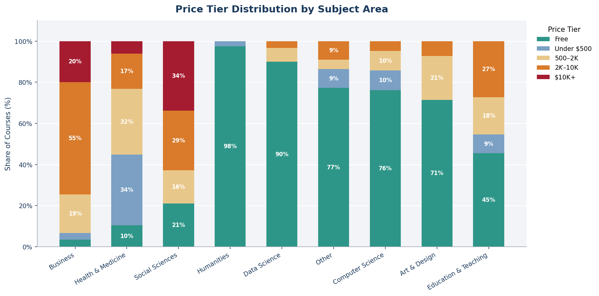
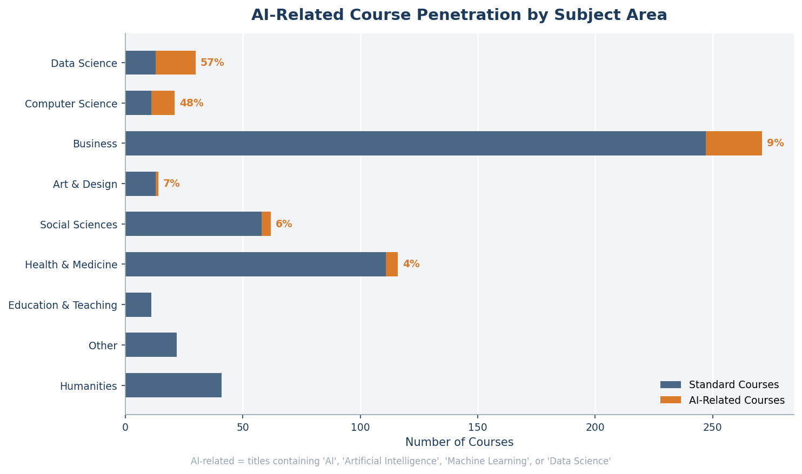
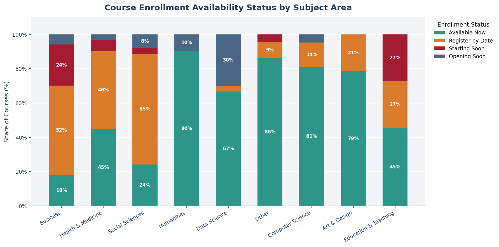

# Harvard Professional Learning — Catalog Intelligence Report

- **Source:** Harvard Professional & Lifelong Learning public course catalog
- **Courses analyzed:** 588  **Subjects covered:** 11  **Report date:** February 2026

---

## Executive Summary

Harvard's professional education catalog is a 588-course portfolio generating revenue across
11 subject areas. Three findings define its commercial character:

- **Business is the undisputed revenue engine** — 46% of all courses, almost entirely paid,
  with a median price of $3,200.
- **Free content is a deliberate acquisition strategy** — 25% of the catalog is free, but
  concentrated in non-commercial subjects (Humanities 98%, Data Science 90%) to build
  brand reach and funnel learners toward paid programs.
- **In-person delivery commands a 3× price premium** — median $4,200 vs. $1,250 online,
  signaling that format is a key pricing lever, not just a delivery choice.

---

## Finding 1 — Business Dominates the Catalog at 46%

Harvard's catalog is not evenly distributed. Business owns **271 of 588 courses** — more
than the next four subjects combined. Health & Medicine is a distant second at 116 courses
(20%), followed by Social Sciences at 62 (11%).

**What this means for decision-makers:**

The portfolio is heavily concentrated. This gives Harvard deep competitive strength in
Business but creates single-subject exposure risk. A demand shift — economic downturn
reducing corporate training budgets, or a competitor targeting Business learners — would
impact nearly half the catalog.

**Decision prompt:** Consider whether the outsized Business concentration is an intentional
dominance play or a gap in developing other high-value subjects such as Social Sciences,
which already commands premium pricing (see Finding 5).

---

## Finding 2 — Delivery Format Varies Sharply by Subject

Subjects differ significantly in *how* they are delivered:

- **Business** leans heavily In-Person (~60%), reflecting the premium corporate cohort model.
- **Humanities, Data Science, Computer Science** are overwhelmingly Online — these subjects
  are built for global, self-paced access rather than executive cohorts.
- **Blended** programs are rare (2% overall) but carry the highest price point of all formats
  (see Finding 4), suggesting they serve a niche ultra-premium segment.

**What this means for decision-makers:**

Format is not just an operational decision — it is a pricing and positioning decision.
Subjects that are entirely online are effectively capped at the online price ceiling
($1,250 median). Any subject seeking to move up-market would need to introduce in-person
or blended options.

**Decision prompt:** Online Live (7% of catalog) represents an underexplored middle ground —
live cohort interaction at lower delivery cost than physical programs. Expanding Online Live
in Business or Health & Medicine could capture learners who want cohort experience without
travel.

---

## Finding 3 — Free Content Is a Strategic Top-of-Funnel, Not Charity

At first glance, 149 free courses (25% of the catalog) seem like foregone revenue. In
reality, the free/paid split reveals a sophisticated funnel architecture:

| Subject | Free Share | Role in Portfolio |
|---|---|---|
| Humanities | 98% | Brand reach, goodwill |
| Data Science | 90% | Talent pipeline acquisition |
| Computer Science | 76% | Community building |
| Business | 3% | Revenue generation |
| Health & Medicine | 10% | Mixed — CME credits drive paid |

Subjects with near-100% free content serve as top-of-funnel brand builders — drawing
millions of learners into the Harvard ecosystem. Business, which is 97% paid, converts
that brand trust into direct revenue.

**What this means for decision-makers:**

The free-to-paid conversion pathway matters enormously. If a learner starts with a free
Data Science course and later enrolls in a paid Business or Health program, the free
content has more than paid for itself.

**Decision prompt:** Is there a formal nurture path from free courses to paid programs?
Mapping learner journeys from high-free subjects (Data Science, Humanities) into paid
Business courses could be a significant revenue unlock without adding new inventory.

---

## Finding 4 — In-Person Delivery Commands a 3.4× Price Premium

The delivery format gap in pricing is dramatic:

| Delivery Mode | Median Price | Courses |
|---|---|---|
| Blended | $9,500 | 11 |
| In-Person | $4,200 | 211 |
| Online Live | $2,950 | 43 |
| Online | $1,250 | 174 |

Blended programs — combining in-person and online — command the highest price of any
format. In-Person at $4,200 median is more than three times the Online median of $1,250.
The IQR range for In-Person is also wide, indicating a broad price band from
mid-market to ultra-premium ($50K+).

**What this means for decision-makers:**

Every course converted from Online to In-Person or Online Live represents a potential
2–3× revenue increase per enrollment. Format upgrades are the fastest revenue lever
available without creating new course content.

**Decision prompt:** Which Online courses have the audience profile (corporate, senior
executive) that would support an In-Person or Online Live version? A targeted format
expansion program could materially increase average revenue per course.

---

## Finding 5 — Social Sciences Is the Hidden High-Value Subject

The median paid course price by subject reveals a counterintuitive result:

| Subject | Median Paid Price |
|---|---|
| Social Sciences | $6,600 |
| Business | $3,200 |
| Education & Teaching | $2,218 |
| Computer Science | $1,995 |
| Health & Medicine | $1,025 |

**Social Sciences commands twice the price of Business** at the median. Courses in this
subject — covering leadership in national security, international executive programs, law,
and policy — attract senior public-sector and government clients with large training
budgets and a high willingness to pay.

**What this means for decision-makers:**

Social Sciences is a premium niche that is significantly underinvested — only 62 courses
(11% of catalog) vs. Business at 271. Its high price point and relatively small catalog
suggest strong unmet demand.

**Decision prompt:** A targeted expansion of Social Sciences with 15–20 new senior
executive programs in governance, policy, and international leadership could yield
disproportionate revenue relative to content volume.

---

## Finding 6 — Price Tier Concentration in the $2K–$10K Band

Across all subjects, the largest single price tier is **$2K–$10K with 194 courses (33%)**,
followed by Free (25%), then $500–$2K (18%), $10K+ (14%), and Under $500 (9%).

The $10K+ premium segment — 82 courses — is concentrated almost entirely in Business and
Social Sciences, including multi-week immersion programs priced up to $52,000.

Health & Medicine diverges from other paid subjects: the majority of its paid courses sit
in the **$500–$2K** tier, reflecting a continuing medical education (CME) pricing model
rather than an executive leadership model.

**What this means for decision-makers:**

- The $10K+ segment is Harvard's highest-margin product line but represents only 14% of
  courses. Premium program expansion is a clear path to revenue growth.
- Health & Medicine's low median price ($1,025) is a strategic question: is this a
  deliberate CME market play, or an untapped premium opportunity given the subject's
  20% catalog share?

**Decision prompt:** Health & Medicine has 116 courses but a median price 3× lower than
Business. Even moving 20% of its courses into the $2K–$5K range would have a measurable
portfolio revenue impact.

---

## Finding 7 — AI Has Penetrated Technical Subjects but Barely Touched the Largest Markets

Defining AI-related courses as those featuring AI, Machine Learning, or Data Science
prominently in the title:

| Subject | AI-Related Share |
|---|---|
| Data Science | 57% |
| Computer Science | 48% |
| Business | 9% |
| Social Sciences | 6% |
| Health & Medicine | 4% |

AI has thoroughly transformed the technical subjects — expected, given those subjects are
definitionally AI-adjacent. But the two largest subjects by course volume — **Business
(9%)** and **Health & Medicine (4%)** — have barely integrated AI into their offerings.

This is the most significant strategic gap in the catalog.

**What this means for decision-makers:**

The global corporate appetite for AI literacy at the leadership level has never been
higher. Executives, board members, healthcare administrators, and legal professionals are
actively seeking AI education but cannot access it within their subject area. Harvard
currently serves this demand only at the margins.

**Decision prompt:** A dedicated "AI for Non-Technical Leaders" track across Business,
Health, and Social Sciences — reusing existing AI content but repackaged for the executive
buyer persona — is the highest-impact product development opportunity visible in this data.

---

## Finding 8 — 62% of the Catalog Requires Active Enrollment Decisions

Enrollment status breaks down as:

| Status | Courses | Share |
|---|---|---|
| Register by Date | 246 | 42% |
| Available Now | 225 | 38% |
| Starting Soon | 78 | 13% |
| Opening Soon | 39 | 7% |

Only 38% of the catalog is immediately accessible. The remaining 62% has deadlines,
future start dates, or waitlists — creating enrollment urgency and scarcity signaling.

Business courses lean heavily toward deadline-based registration, reinforcing the
cohort-based learning model that supports premium pricing. Humanities and Data Science
courses, by contrast, are almost entirely "Available Now," consistent with their
self-paced, open-access format.

**What this means for decision-makers:**

Scarcity is a pricing tool. Cohort-based, deadline-driven programs signal exclusivity
and facilitate corporate bulk purchases tied to budget cycles. The 62% figure suggests
Harvard actively manages demand through structured enrollment windows rather than
unlimited open enrollment.

**Decision prompt:** Are enrollment deadlines being leveraged in marketing? Courses with
upcoming deadlines represent the highest-urgency conversion opportunity — ensuring
prospective learners see registration deadlines before the window closes is a
straightforward revenue protection action.

---

## Strategic Recommendations Summary

| Priority | Recommendation | Insight Source |
|---|---|---|
| 1 | Launch an "AI for Leaders" track in Business and Health & Medicine | Finding 7 — AI gap in largest subjects |
| 2 | Expand Social Sciences premium programs (target: +15–20 courses) | Finding 5 — highest price per course |
| 3 | Convert high-demand Online Business courses to Online Live format | Finding 4 — 3× price premium for live delivery |
| 4 | Build a formal free-to-paid nurture journey from Data Science/Humanities | Finding 3 — 25% free catalog as acquisition channel |
| 5 | Re-evaluate Health & Medicine pricing strategy vs. Business model | Finding 6 — $1,025 vs $3,200 median gap |

---

## Catalog at a Glance

| Metric | Value |
|---|---|
| Total courses | 588 |
| Subjects | 11 |
| Free courses | 149 (25%) |
| Paid courses | 439 (75%) |
| Median paid price | $3,200 |
| Most common price tier | $2K–$10K (33%) |
| Largest subject | Business (271 courses, 46%) |
| Highest-priced format | Blended ($9,500 median) |
| AI-related courses | 61 (10%) |
| Immediately available | 225 (38%) |
