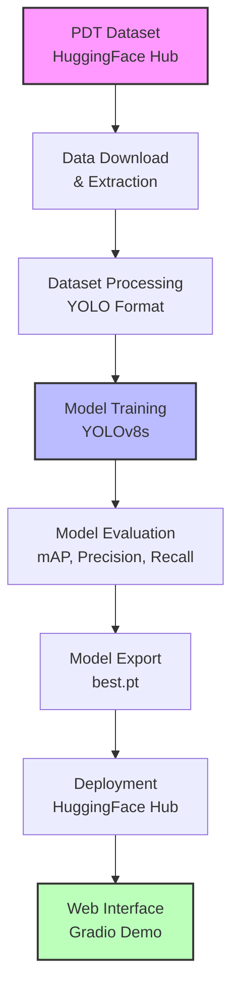
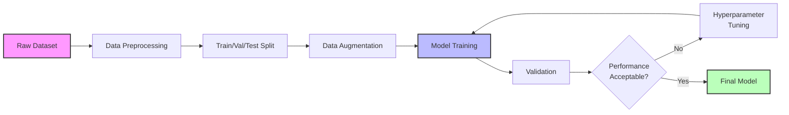
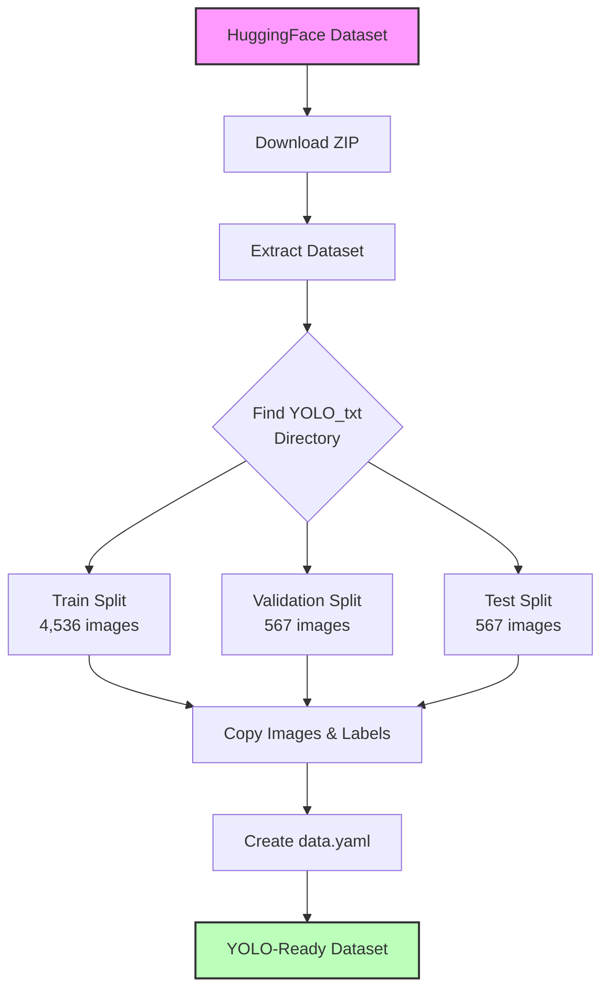
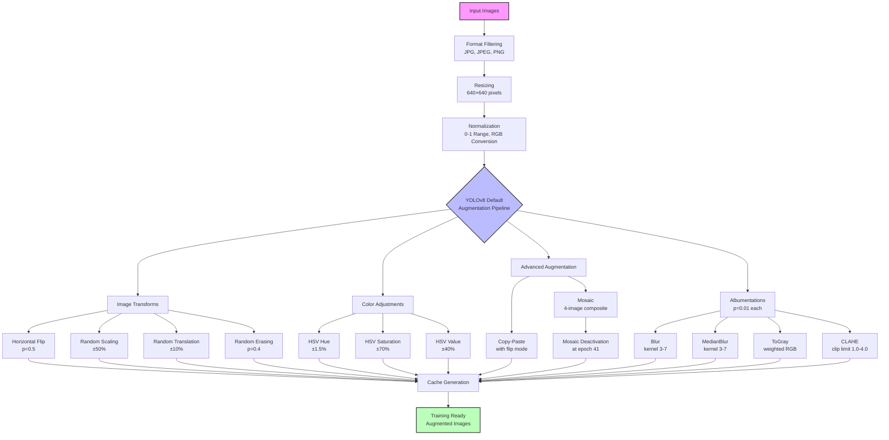
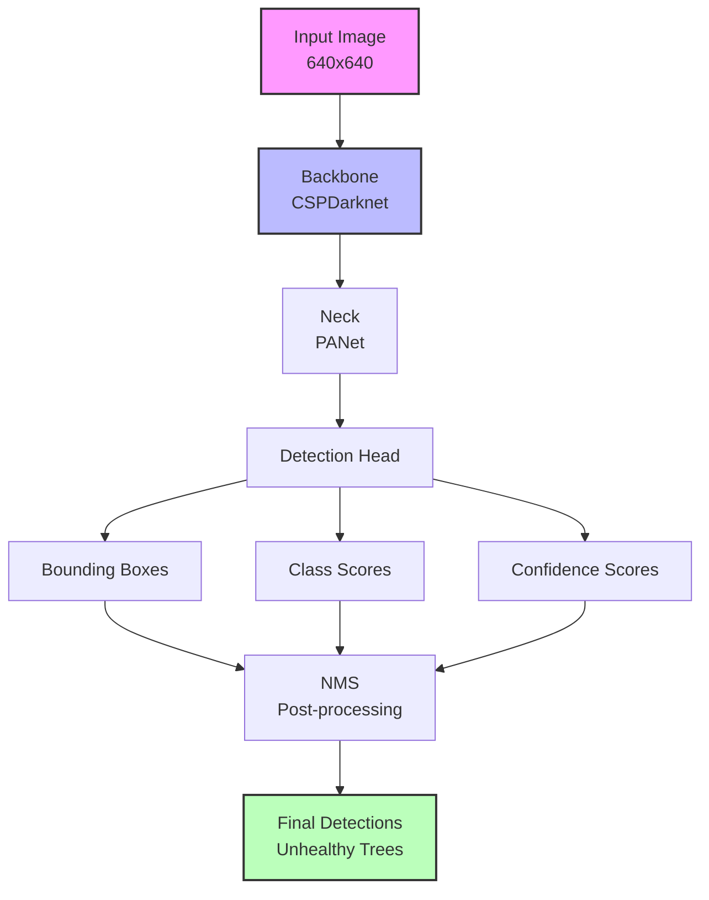
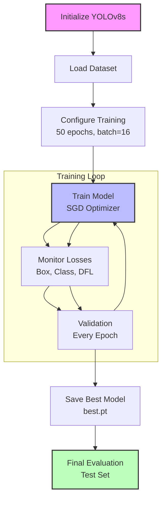
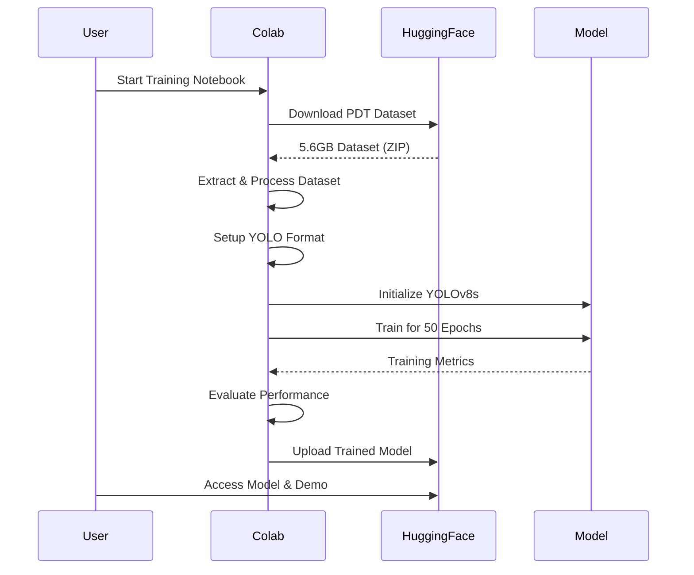
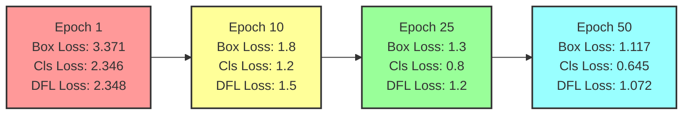
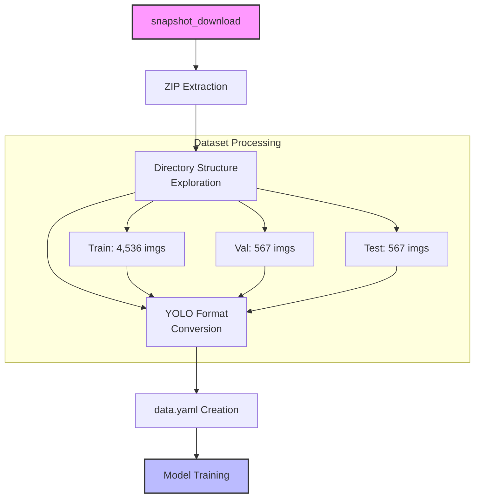
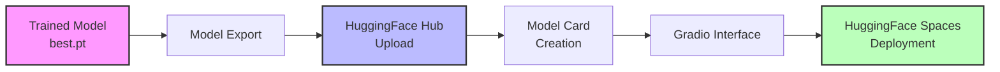

# Tree Disease Detection using YOLOv8

[](https://opensource.org/licenses/MIT)
[](https://www.python.org/downloads/)
[](https://colab.research.google.com/github/Ismat-Samadov/crop_desease_detection/blob/main/crop_desease_detection.ipynb)
[](https://huggingface.co/IsmatS/crop_desease_detection)
[](https://huggingface.co/spaces/IsmatS/tree-disease-detector-demo)

A deep learning project for detecting unhealthy/diseased trees in aerial UAV imagery using YOLOv8s architecture. This model achieves 93.3% mAP50 on the PDT (Pests and Diseases Tree) dataset.


## 🎓 Project Overview

This university project demonstrates a complete machine learning pipeline for computer vision-based tree disease detection. The system uses state-of-the-art YOLO architecture to identify unhealthy trees in aerial imagery, which has practical applications in forest management and precision agriculture.

## 🏗️ System Architecture



## 📊 Training Pipeline



## 🔄 Data Processing Workflow



## 🔍 YOLOv8 Default Preprocessing Pipeline



The model automatically applies YOLOv8's sophisticated preprocessing pipeline without explicit coding. These preprocessing stages significantly contribute to the model's robustness and accuracy:

### Basic Processing
- **Format Filtering**: Only JPG, JPEG, and PNG images are processed
- **Resizing**: All images standardized to 640×640 pixels
- **Normalization**: Pixel values normalized to [0-1] range
- **Color Space**: BGR to RGB conversion

### YOLOv8 Default Augmentations
- **Geometric Transforms**:
  - Horizontal flipping (50% probability)
  - Random scaling (±50% variation)
  - Random translation (±10% of image size)
  - Random erasing (40% probability)

- **Color Adjustments**:
  - Hue variation: ±1.5%
  - Saturation variation: ±70%
  - Brightness variation: ±40%

- **Advanced Augmentation**:
  - Mosaic: Combines 4 training images (until epoch 40)
  - Mosaic deactivation: Turned off for final 10 epochs

- **Albumentations Library** (1% probability each):
  - Blur: Random Gaussian blur (kernel 3-7)
  - MedianBlur: Salt and pepper noise reduction (kernel 3-7)
  - ToGray: Grayscale conversion with weighted average
  - CLAHE: Contrast Limited Adaptive Histogram Equalization (8×8 tile grid)

These preprocessing techniques work together to create a robust training dataset that helps the model generalize well to different lighting conditions, perspectives, and image qualities encountered in real-world UAV imagery.

## 🤖 Model Architecture



## 📈 Training Process



## 🚀 Quick Links

- 🤗 **[Interactive Demo on Hugging Face Spaces](https://huggingface.co/spaces/IsmatS/tree-disease-detector-demo)**
- 🤗 **[Model on Hugging Face Hub](https://huggingface.co/IsmatS/crop_desease_detection)**
- 📓 **[Google Colab Notebook](https://colab.research.google.com/github/Ismat-Samadov/crop_desease_detection/blob/main/crop_desease_detection.ipynb)**

## 🎯 Try It Now!

Experience the model in action with our interactive demo:

<div align="center">
  <a href="https://huggingface.co/spaces/IsmatS/tree-disease-detector-demo">
    
  </a>
</div>

## 📊 Model Performance

| Metric | Value |
|--------|-------|
| mAP50 | 0.933 |
| mAP50-95 | 0.659 |
| Precision | 0.878 |
| Recall | 0.863 |
| Training Time | 24.5 minutes |
| Device | NVIDIA A100-SXM4-40GB |

## 🔍 Detection Examples

Here are some example detections from the model showing unhealthy tree identification:

<div align="center">


</div>

<div align="center">


</div>

<div align="center">

</div>

The model successfully identifies unhealthy trees in various aerial imagery conditions, with confidence scores ranging from 0.32 to 0.86. These examples demonstrate the model's ability to detect multiple diseased trees in a single image with accurate bounding boxes.

## 📋 Test Predictions Preview

The following examples demonstrate the model's real-world performance on diverse test images, showcasing its ability to distinguish between healthy and diseased trees across various conditions:

### Disease Detection Results

<div align="center">

</div>

**Disease Detection Analysis:**
- The model successfully identifies multiple diseased trees in aerial imagery
- Bounding boxes accurately localize unhealthy vegetation with high confidence scores
- Detection works effectively across different lighting conditions and tree densities
- Multiple diseased trees can be detected simultaneously in a single image
- Confidence scores typically range from 0.3 to 0.9, indicating reliable detection thresholds

### Health Classification Results

<div align="center">

</div>

**Health Classification Analysis:**
- The model correctly identifies healthy forest areas without false positive detections
- Clean background classification demonstrates the model's ability to distinguish healthy from diseased vegetation
- No erroneous bounding boxes on healthy trees, showing good precision
- Robust performance in dense forest environments with varying canopy coverage
- Effective handling of different aerial perspectives and image resolutions

### Key Performance Insights

These test predictions validate several critical aspects of the model:

1. **Accuracy**: High precision in distinguishing diseased from healthy trees
2. **Robustness**: Consistent performance across different environmental conditions
3. **Scalability**: Effective detection in both sparse and dense forest areas
4. **Reliability**: Stable confidence scoring for practical deployment
5. **Versatility**: Adaptable to various UAV imaging scenarios and altitudes

The test results confirm the model's readiness for real-world applications in precision agriculture, forest management, and environmental monitoring.

## 🌟 Features

- High-accuracy detection of unhealthy trees in aerial imagery
- Optimized for UAV/drone captured images at 640x640 resolution
- Fast inference (~7ms per image on GPU)
- Pre-trained model available on [Hugging Face](https://huggingface.co/IsmatS/crop_desease_detection)
- Interactive web demo on [Hugging Face Spaces](https://huggingface.co/spaces/IsmatS/tree-disease-detector-demo)

## 📁 Project Structure

```
crop_desease_detection/
├── crop_desease_detection.ipynb  # Main training notebook
├── crop_desease_detection.py     # Python implementation
├── LICENSE                       # MIT License
├── README.md                     # This file
└── static/                       # Static assets
    ├── training_results.png      # Model performance visualization
    ├── pred_2.png               # Example detection 2
    ├── pred_3.png               # Example detection 3
    ├── pred_4.png               # Example detection 4
    ├── pred_5.png               # Example detection 5
    └── pred_6.png               # Example detection 6
```

## 🚀 Quick Start

### Installation

```bash
pip install ultralytics torch torchvision opencv-python matplotlib
```

### Using the Pre-trained Model

You can load the model directly from Hugging Face:

```python
from ultralytics import YOLO

# Load model from Hugging Face
model = YOLO('https://huggingface.co/IsmatS/crop_desease_detection/resolve/main/best.pt')

# Or use the model ID
model = YOLO('IsmatS/crop_desease_detection')

# Run inference
results = model('path/to/your/image.jpg')

# Process results
for result in results:
    boxes = result.boxes
    if boxes is not None:
        for box in boxes:
            confidence = box.conf[0]
            bbox = box.xyxy[0]
            print(f"Unhealthy tree detected with {confidence:.2f} confidence")

# Save annotated image
results[0].save('result.jpg')
```

### Web Interface

For a user-friendly interface, visit our [Hugging Face Space](https://huggingface.co/spaces/IsmatS/tree-disease-detector-demo) where you can:
- Upload images directly
- Adjust detection thresholds
- Visualize results instantly
- Download annotated images

### 📋 Step-by-Step Training Process

Based on our training notebook, here's the complete pipeline:



## 📊 Dataset

This model was trained on the [PDT (Pests and Diseases Tree) dataset](https://huggingface.co/datasets/qwer0213/PDT_dataset):

- **Training Images**: 4,536
- **Validation Images**: 567
- **Test Images**: 567
- **Resolution**: 640x640 pixels
- **Classes**: 1 (unhealthy trees)

### Dataset Statistics

| Split | Images | Labels | Backgrounds |
|-------|--------|--------|-------------|
| Train | 4,536  | 3,206  | 1,330      |
| Val   | 567    | 399    | 168        |
| Test  | 567    | 390    | 177        |

## 🏗️ Model Architecture

- **Base Model**: YOLOv8s
- **Input Size**: 640x640 pixels
- **Parameters**: 11.1M
- **GFLOPs**: 28.6
- **Layers**: 129

The trained model is available on [Hugging Face Model Hub](https://huggingface.co/IsmatS/crop_desease_detection).

### Training Configuration

```yaml
epochs: 50
batch_size: 16
optimizer: SGD
learning_rate: 0.01
momentum: 0.9
weight_decay: 0.001
device: CUDA (NVIDIA A100-40GB)
```

## 📈 Results

The model achieved excellent performance on the validation set:

- Fast convergence: reached 0.878 precision by epoch 13
- Stable training: consistent improvement without overfitting
- High accuracy: 93.3% mAP50 on validation data

View training results and performance metrics on our [Hugging Face Model Card](https://huggingface.co/IsmatS/crop_desease_detection).

## 📊 Understanding Training Metrics

### Overall Performance

Your model achieved excellent results:
- **93.3% mAP50** - Primary accuracy metric for object detection
- **65.9% mAP50-95** - Stricter accuracy measure using multiple IoU thresholds
- **87.8% Precision** - When detecting a diseased tree, the model is correct 87.8% of the time
- **86.3% Recall** - The model finds 86.3% of all diseased trees in images
- **Training Time**: 24.5 minutes on NVIDIA A100-40GB GPU

### Loss Function Evolution



### Training Progress Analysis

#### Loss Metrics Breakdown

The training process tracked three types of losses that decreased over 50 epochs:

1. **Box Loss (box_loss)**: 3.371 → 1.117
   - Measures bounding box coordinate prediction accuracy
   - Lower values indicate better localization of diseased trees

2. **Classification Loss (cls_loss)**: 2.346 → 0.6453
   - Measures object classification accuracy
   - Significant reduction shows improved disease identification

3. **DFL Loss (Distribution Focal Loss)**: 2.348 → 1.072
   - Helps with precise bounding box regression
   - Steady decrease indicates better boundary detection

#### Evaluation Metrics Evolution

- **mAP50**: Improved from 28.8% (epoch 1) to 93.3% (final)
  - Mean Average Precision at 50% IoU threshold
  - Primary accuracy metric for object detection

- **mAP50-95**: Rose from 12% to 65.9%
  - Average mAP for IoU thresholds from 50% to 95%
  - More stringent metric; 65.9% is excellent

- **Precision**: Reached 87.8%
  - True positives / (True positives + False positives)
  - Low false positive rate

- **Recall**: Achieved 86.3%
  - True positives / (True positives + False negatives)
  - Finds most diseased trees in images

### Training Characteristics

1. **Fast Initial Learning**: Major improvements in first 10 epochs
2. **Stable Plateau**: Performance stabilized around epochs 20-30
3. **Fine-tuning Phase**: Gradual improvements in final epochs
4. **No Overfitting**: Validation metrics continued improving throughout

### Model Efficiency

- **Inference Speed**: ~7ms per image on GPU
- **Model Size**: 11.1M parameters (lightweight)
- **Batch Processing**: 16 images per batch at 640x640 resolution

### Dataset Insights

The model was trained on:
- **Training**: 4,536 images (3,206 with diseased trees, 1,330 healthy backgrounds)
- **Validation**: 567 images (399 with diseased trees, 168 backgrounds)
- **Test**: 567 images (390 with diseased trees, 177 backgrounds)

Background images help the model learn to distinguish healthy from diseased trees, reducing false positives.

## 🔧 Advanced Usage

### Custom Inference Settings

```python
# Adjust detection parameters
results = model.predict(
    source='path/to/image.jpg',
    conf=0.25,  # Confidence threshold
    iou=0.45,   # IoU threshold for NMS
    imgsz=640,  # Inference size
    save=True   # Save results
)
```

### Batch Processing

```python
import glob

# Process multiple images
image_paths = glob.glob('path/to/images/*.jpg')
results = model(image_paths, batch=8)

# Process results
for i, result in enumerate(results):
    print(f"Image {i}: Detected {len(result.boxes)} unhealthy trees")
    result.save(f'result_{i}.jpg')
```

### API Usage

You can also use the model through the Hugging Face Inference API:

```python
import requests

API_URL = "https://api-inference.huggingface.co/models/IsmatS/crop_desease_detection"
headers = {"Authorization": "Bearer YOUR_HF_TOKEN"}

def query(filename):
    with open(filename, "rb") as f:
        data = f.read()
    response = requests.post(API_URL, headers=headers, data=data)
    return response.json()

output = query("your_image.jpg")
```

## 🌐 Applications

- **Precision Agriculture**: Early detection of diseased trees in orchards
- **Forest Management**: Large-scale monitoring of forest health
- **Environmental Monitoring**: Tracking disease spread patterns
- **Research**: Studying tree disease progression

## 🔬 Technical Implementation Details

### Data Pipeline Implementation



### Model Deployment Pipeline



## 🤝 Contributing

Contributions are welcome! Please feel free to submit a Pull Request.

1. Fork the project
2. Create your feature branch (`git checkout -b feature/AmazingFeature`)
3. Commit your changes (`git commit -m 'Add some AmazingFeature'`)
4. Push to the branch (`git push origin feature/AmazingFeature`)
5. Open a Pull Request

## 📄 License

This project is licensed under the MIT License - see the [LICENSE](LICENSE) file for details.

## 🙏 Acknowledgments

- [PDT Dataset](https://huggingface.co/datasets/qwer0213/PDT_dataset) by Zhou et al., ECCV 2024
- [Ultralytics YOLOv8](https://github.com/ultralytics/ultralytics) framework
- Training performed on Google Colab with NVIDIA A100 GPU
- Model hosted on [Hugging Face](https://huggingface.co/IsmatS/crop_desease_detection)
- Demo hosted on [Hugging Face Spaces](https://huggingface.co/spaces/IsmatS/tree-disease-detector-demo)

## 📚 Citation

If you use this model in your research, please cite:

```bibtex
@software{samadov2024treedisease,
  author = {Ismat Samadov},
  title = {Tree Disease Detection using YOLOv8},
  year = {2024},
  publisher = {GitHub},
  url = {https://github.com/Ismat-Samadov/crop_desease_detection}
}

@inproceedings{zhou2024pdt,
  title={PDT: Uav Target Detection Dataset for Pests and Diseases Tree},
  author={Zhou, Mingle and Xing, Rui and others},
  booktitle={ECCV},
  year={2024}
}
```

## 🔗 Important Links

- 🤗 **Model**: [https://huggingface.co/IsmatS/crop_desease_detection](https://huggingface.co/IsmatS/crop_desease_detection)
- 🚀 **Demo**: [https://huggingface.co/spaces/IsmatS/tree-disease-detector-demo](https://huggingface.co/spaces/IsmatS/tree-disease-detector-demo)
- 💻 **GitHub**: [https://github.com/Ismat-Samadov/crop_desease_detection](https://github.com/Ismat-Samadov/crop_desease_detection)
- 📊 **Dataset**: [https://huggingface.co/datasets/qwer0213/PDT_dataset](https://huggingface.co/datasets/qwer0213/PDT_dataset)
- 🪿 **Notebook**: [https://www.kaggle.com/code/ismetsemedov/crop-desease-detection](https://www.kaggle.com/code/ismetsemedov/crop-desease-detection)
